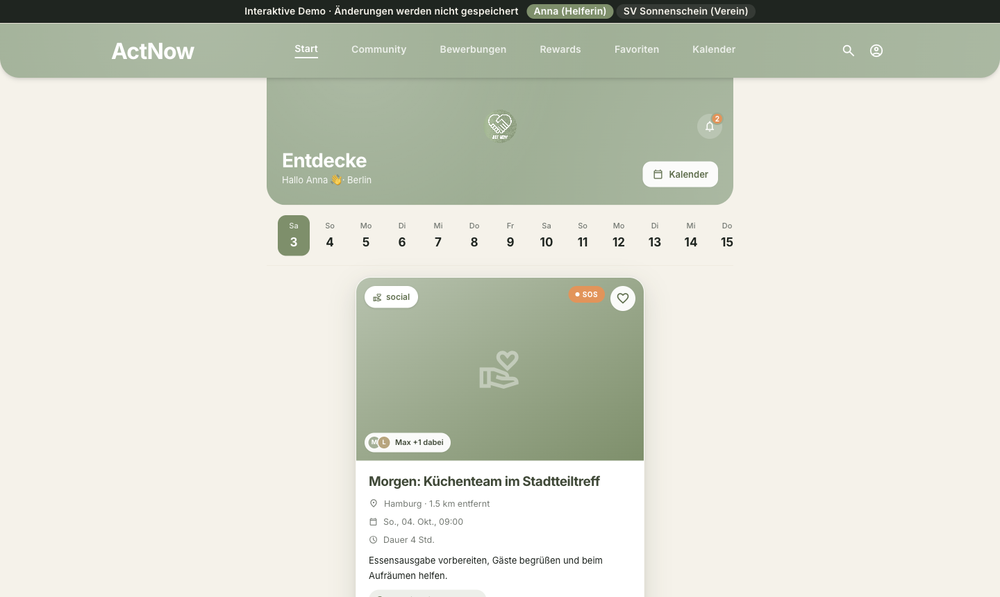
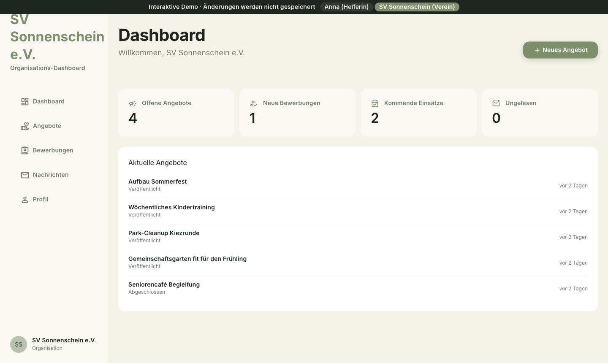

# ActNow

**A volunteer matching platform:** helpers swipe through volunteering opportunities near them, and non-profit organisations publish offers, review applications and chat with helpers.

[](https://actnow.yannik-h-huber.de)
[](https://github.com/41yannik/ActNow/actions/workflows/ci.yml)
[](https://github.com/41yannik/ActNow/actions/workflows/deploy-pages.yml)


**[Try the interactive demo](https://actnow.yannik-h-huber.de)**: no sign-up needed. Switch between the helper view (Anna) and the organisation view (SV Sonnenschein) in the top bar. The demo runs on fictional data and saves nothing.

| Helper view: discover and swipe | Organisation view: dashboard |
|---|---|
|  |  |

> The interface is in German, since the platform targets volunteers in Germany.

## The problem

Non-profits need helpers on short notice. People who want to volunteer often don't know which organisations near them need help. ActNow brings both sides together: offers by place and time, applications and messaging in one app, and mutual ratings to build trust. Full problem statement: [docs/problem-statement.md](docs/problem-statement.md).

## Features

**For helpers:** swipe-based discovery, applications, calendar, favourites, community, profile.
**For organisations:** dashboard, offer management, application review, messaging, organisation profile.

## Architecture

The product was built as a full-stack app on SvelteKit and Supabase (Postgres, Row Level Security, Realtime, Storage). For the public portfolio version the frontend runs as a **static, read-only demo**: a local `DemoRepository` serves fictional fixtures, and write actions show a notice instead of changing data. No backend, login or cookies are involved.

```
Visitor → GitHub Pages → static SvelteKit SPA → DemoRepository (fixtures, read-only)
```

The backend work stays in the repo as reference: versioned Supabase migrations, RLS policies and an RLS smoke test suite in [`supabase/`](supabase/).

## Tech stack

SvelteKit 2 · Svelte 5 · TypeScript · Tailwind CSS · Supabase (Postgres, RLS, Realtime) · Playwright · ESLint and Prettier · GitHub Actions and GitHub Pages

## Run locally

```bash
cd frontend
corepack pnpm install --frozen-lockfile
corepack pnpm dev
```

Quality gates (the same ones CI runs):

```bash
corepack pnpm lint
corepack pnpm check
corepack pnpm exec playwright install chromium
corepack pnpm test:e2e
corepack pnpm build
```

## Project structure

```
.
├── frontend/   # SvelteKit app (routes for public, helper and organisation areas)
├── supabase/   # migrations, RLS policies, seed data, RLS tests (reference)
├── docs/       # problem statement, user stories, data model, API contract, roadmap
└── scripts/
```

Detailed specification (German): [docs/README.md](docs/README.md).

## Team and my role

University team project by **Yannik Huber**, Dennis Müller and Arian Sharifi-Tabar.

I wrote most of the commits and led the production hardening and the portfolio release:

- Supabase schema as versioned migrations, RLS policies and an RLS smoke test suite
- Supabase services for applications, messages, notifications and saved offers
- tooling and CI: ESLint, Prettier, GitHub Actions, static build
- conversion into the read-only portfolio demo with role switcher and GitHub Pages deployment

## License

[MIT](LICENSE)
